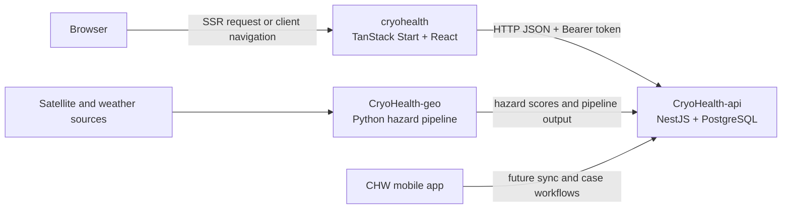
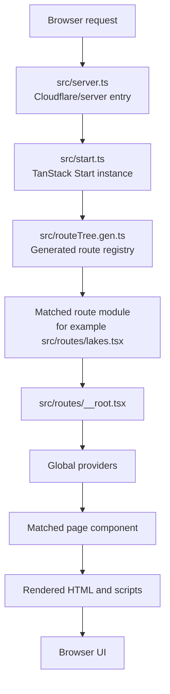
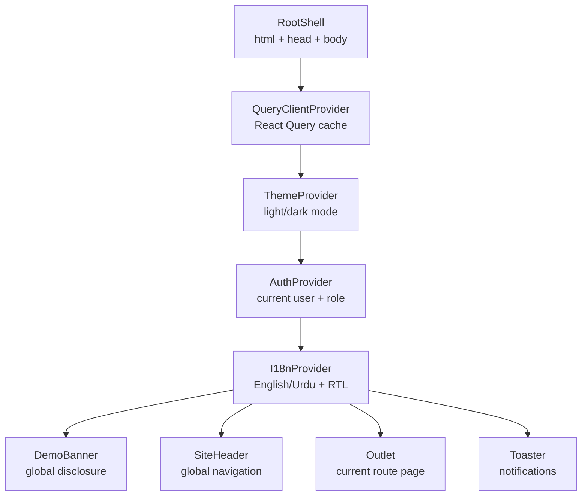
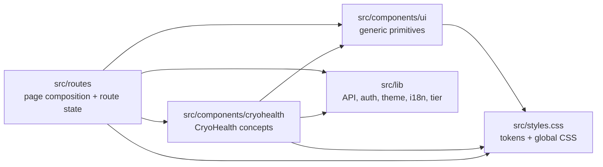
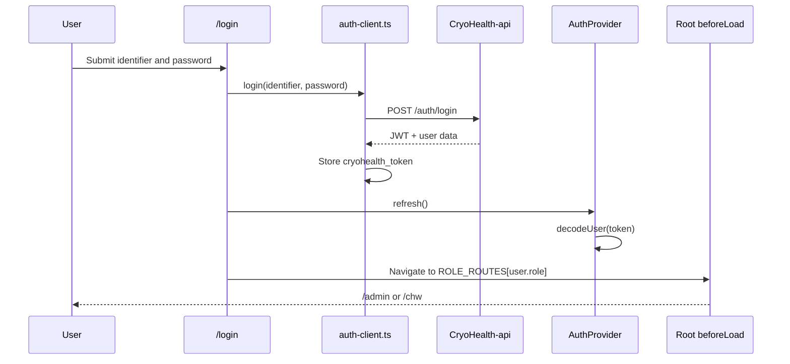
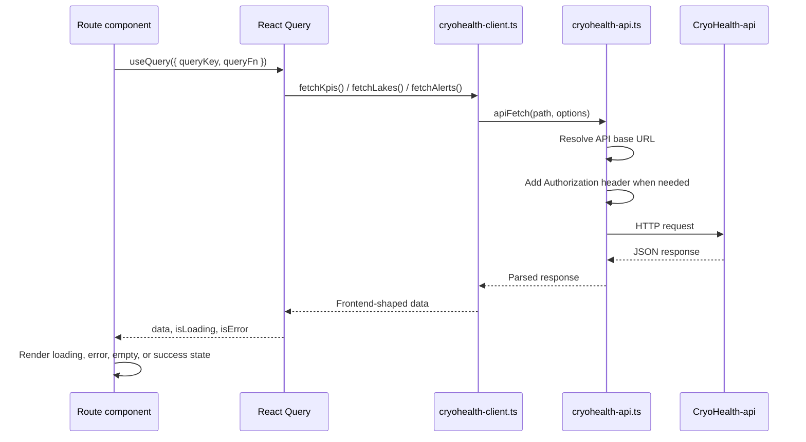
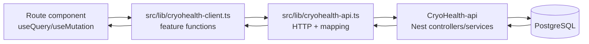
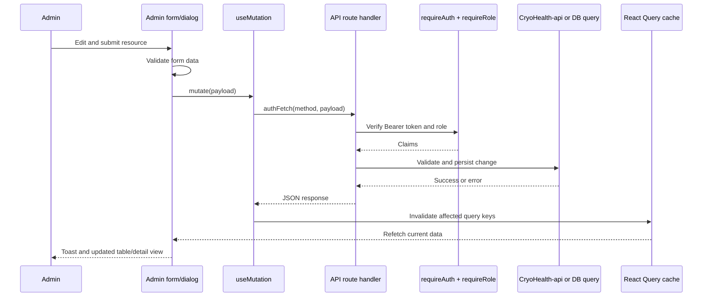
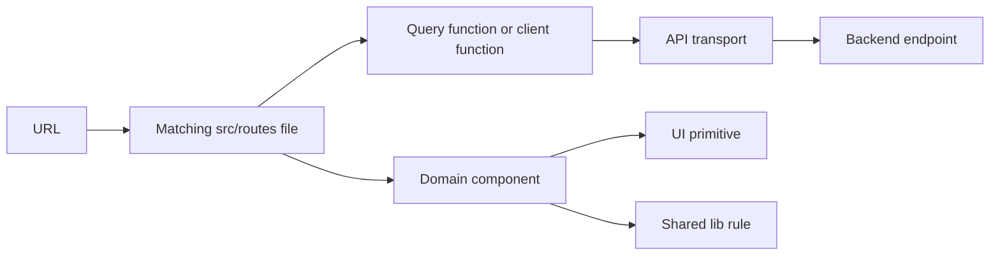
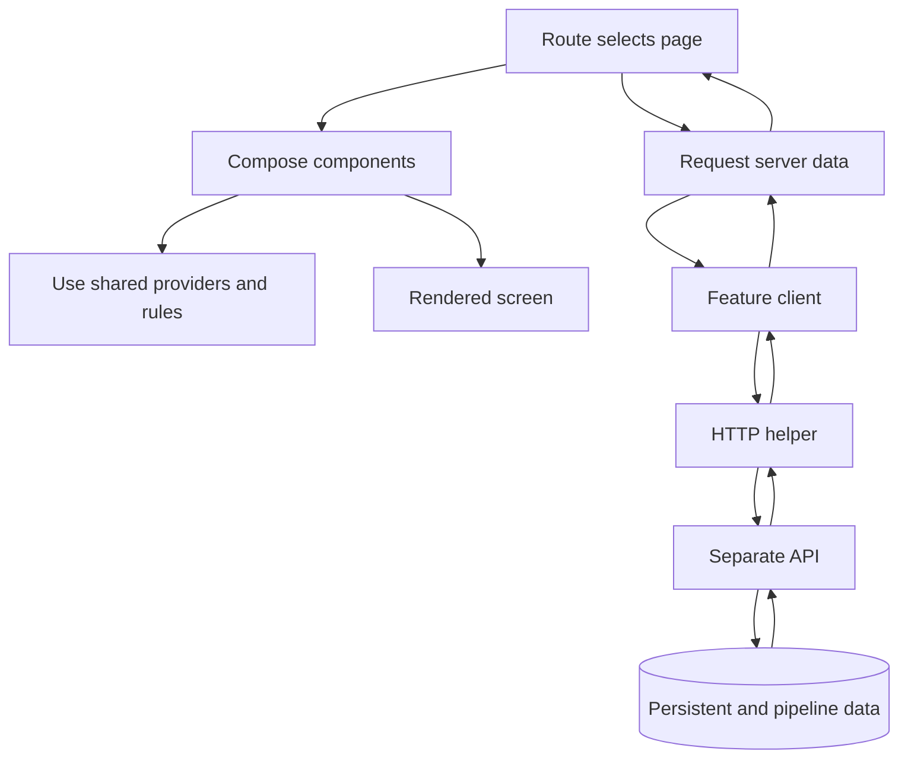

# CryoHealth Frontend Architecture

This document is a visual guide to the `cryohealth` frontend. It explains how a browser request becomes a page, how providers and components are composed, how authentication controls navigation, and how route data travels to the separate CryoHealth API.

## 1. System Boundary

CryoHealth has three cooperating applications. The frontend is responsible for page composition and user interaction; the API owns business data and authorization; the geo service produces hazard data.



The frontend workspace is `cryohealth/`. The sibling `CryoHealth-api/` and `CryoHealth-geo/` folders are not imported as frontend modules. They communicate across HTTP or pipeline/database boundaries.

## 2. Browser Request to Rendered Page

TanStack Start handles both the server request and the browser-side route transition. The generated route tree is a registry, not a place for application logic.



### Important files

| Responsibility | File |
| --- | --- |
| Cloudflare/server entry | `src/server.ts` |
| TanStack Start setup | `src/start.ts` |
| Router instance and context | `src/router.tsx` |
| Generated route registry | `src/routeTree.gen.ts` |
| Root document and global shell | `src/routes/__root.tsx` |
| Global styling | `src/styles.css` |

`src/routeTree.gen.ts` is generated. Add or rename route files instead of editing this registry manually.

## 3. Global Component Tree

Every matched page is rendered inside the root shell. The provider order matters because children can consume only providers above them.



The root route also defines the application-wide 404 and error components. Those are sibling fallbacks to the normal `Outlet`, not child pages.

### Component ownership



Use this rule when locating code:

- A page-specific workflow belongs in `src/routes/`.
- A reusable lake, glacier, alert, admin, or CHW concept belongs in `src/components/cryohealth/`.
- A generic button, dialog, table, sidebar, or form primitive belongs in `src/components/ui/`.
- Cross-page behavior belongs in `src/lib/`.

## 4. Route Families

TanStack Router uses flat file names with dot segments. A `$` segment means a dynamic URL parameter.

```mermaid
flowchart TD
    RootRoute[/]
    RootRoute --> Public[Public experience]
    RootRoute --> Auth[Authentication]
    RootRoute --> CHW[CHW workspace]
    RootRoute --> Admin[Admin workspace]

    Public --> Dashboard[/dashboard]
    Public --> Lakes[/lakes]
    Lakes --> LakeDetail[/lakes/$lakeId]
    Public --> GlacierDetail[/glaciers/$glacierId]
    Public --> Alerts[/alerts]
    Public --> Data[/data]
    Public --> About[/about]

    Auth --> Login[/login]

    CHW --> CHWPage[/chw]

    Admin --> AdminGate[src/routes/admin.tsx\nrole gate + AdminShell]
    AdminGate --> AdminHome[/admin]
    AdminGate --> AdminResources[admin.* child routes]
    AdminResources --> Inventory[glaciers, lakes, districts]
    AdminResources --> Response[alerts, protocols]
    AdminResources --> Workforce[cases, facilities, CHW profiles]
    AdminResources --> Governance[users, audit, system health, sync]
```

### Admin route nesting

The admin parent is both a route and a layout boundary:

```mermaid
flowchart TD
    AdminRoute[src/routes/admin.tsx]
    AdminRoute --> Check{useAuth().isAdmin?}
    Check -->|loading| Loading[Loading state]
    Check -->|no| Denied[Access required + sign-in link]
    Check -->|yes| Shell[AdminShell]
    Shell --> SideNav[Sidebar navigation]
    Shell --> AdminOutlet[Outlet]
    AdminOutlet --> Child[admin.* page]

    Child --> List[Resource list]
    Child --> Detail[Resource detail]
```

For list/detail resources, the convention is usually three files:

```text
admin.glaciers.tsx              parent with <Outlet />
admin.glaciers.index.tsx        /admin/glaciers list
admin.glaciers.$glacierId.tsx   /admin/glaciers/:glacierId detail
```

Flat pages such as `admin.alerts.tsx` are leaf routes and should not be converted into outlet parents unless the route family needs children.

## 5. Authentication and Navigation Flow

Authentication is JWT-based. The browser stores the token, the auth context decodes it, and API requests attach it as a Bearer header.



```mermaid
flowchart TD
    Request[Route navigation] --> Token[getToken()]
    Token --> Decode[decodeUser(token)]
    Decode --> HasUser{Authenticated?}
    HasUser -->|no| Public[Continue to public route]
    HasUser -->|yes| Allowed{Workspace, login, or alerts?}
    Allowed -->|yes| Continue[Continue]
    Allowed -->|no| PublicPath{isPublicPath(path)?}
    PublicPath -->|no| Continue
    PublicPath -->|yes| RoleRoute[redirect to ROLE_ROUTES[user.role]]
```

The frontend role map is:

| Role | Workspace |
| --- | --- |
| `cryohealth_admin` | `/admin` |
| `facility_admin` | `/admin` |
| `chw` | `/chw` |
| `viewer` | `/chw` |

There are two related but separate checks:

- `src/routes/__root.tsx` redirects authenticated users away from public/static pages.
- `src/routes/admin.tsx` checks `useAuth().isAdmin` before rendering the admin shell.
- `src/lib/auth-guard.ts` verifies Bearer tokens and roles for server handlers that require API protection.

## 6. Standard Data-Loading Flow

Most pages use React Query rather than route loaders. A page owns its query key and calls a feature-level client function.



### Data-layer responsibilities



Keep the layers distinct:

- Routes should not duplicate API base URL logic.
- Components should not know database column names.
- `cryohealth-client.ts` is the feature vocabulary used by pages.
- `cryohealth-api.ts` is the transport and response-mapping boundary.
- The backend remains the source of truth for business rules and persistent data.

## 7. Public Hazard Map Flow

The public map is a useful example because it combines API data, domain components, and a browser-only visualization library.

```mermaid
flowchart TD
    LakesPage[src/routes/lakes.tsx]
    LakesPage --> LakeQuery[useQuery lakes]
    LakeQuery --> Client[fetchLakes()]
    Client --> API[GET CryoHealth-api lakes]
    API --> LakeRows[Lake rows]
    LakeRows --> Filters[Search, tier, district filters]
    Filters --> Map[HazardMap]
    Filters --> Table[Lakes table]
    Map --> Leaflet[Leaflet map instance]
    Leaflet --> Tiles[Tile provider / imagery]
```

`HazardMap` owns map creation, markers, popups, and Leaflet cleanup. The route owns fetching, filtering, and deciding which records are passed to it. That separation keeps the map reusable for the admin dashboard and lake pages.

## 8. Admin Mutation Flow

Admin writes add authorization, validation, a mutation, cache invalidation, and a toast.



For destructive actions, the expected component path is:

```text
Button
  -> AlertDialog confirmation
  -> reason field when audit policy requires it
  -> mutation
  -> server-side role/auth check
  -> database transaction + audit record
  -> cache invalidation
```

## 9. Cross-Cutting Services

```mermaid
flowchart TD
    Page[Any route or component]
    Page --> AuthHook[useAuth()]
    Page --> ThemeHook[useTheme()]
    Page --> I18nHook[useI18n()]
    Page --> QueryHook[useQuery/useMutation]
    Page --> Tier[TierBadge / tierClasses]

    AuthHook --> AuthContext[AuthProvider]
    ThemeHook --> ThemeContext[ThemeProvider]
    I18nHook --> I18nContext[I18nProvider]
    QueryHook --> QueryProvider[QueryClientProvider]
    Tier --> TierRules[src/lib/tier.tsx]

    AuthContext --> TokenStore[localStorage token]
    ThemeContext --> ThemeStore[localStorage theme]
    I18nContext --> LanguageStore[localStorage language]
    QueryProvider --> Cache[React Query cache]
```

The main shared services are:

- `src/lib/auth.tsx`: user, role, loading, sign-out, and refresh state.
- `src/lib/auth-client.ts`: login, token storage, and authenticated fetch support.
- `src/lib/theme.tsx`: theme state and the `dark` document class.
- `src/lib/i18n.tsx`: English/Urdu translations and RTL direction.
- `src/lib/tier.tsx`: the canonical NORMAL/WATCH/HIGH/CRITICAL visual language.
- `src/lib/utils.ts`: shared utility helpers such as class-name composition.

## 10. How to Trace a Feature

When you want to understand one feature, follow this path:



Example: trace the public lakes page in this order:

1. `src/routes/lakes.tsx` — page composition, query, filters, and table.
2. `src/lib/cryohealth-client.ts` — feature function for lakes.
3. `src/lib/cryohealth-api.ts` — HTTP request and response mapping.
4. `src/components/cryohealth/HazardMap.tsx` — map rendering.
5. `src/lib/tier.tsx` — tier labels, colors, and badges.
6. `src/routes/lakes.$lakeId.tsx` — detail-page continuation after a table link.

Example: trace the admin shell in this order:

1. `src/routes/admin.tsx` — admin gate and nested outlet.
2. `src/components/cryohealth/AdminShell.tsx` — sidebar and workspace frame.
3. One `src/routes/admin.*.tsx` page — resource-specific query and UI.
4. `src/components/ui/` — generic table, dialog, form, tabs, or sidebar pieces.
5. `src/lib/auth-guard.ts` and the matching API route — server-side protection.

## 11. Mental Model

The shortest accurate description of the frontend is:

> TanStack Router selects a route. The root route wraps it in global providers. The route composes CryoHealth components and generic UI primitives. React Query calls the feature client, which calls the API transport, which reaches the separate Nest backend. Auth, theme, language, and hazard-tier rules are shared through `src/lib`.


